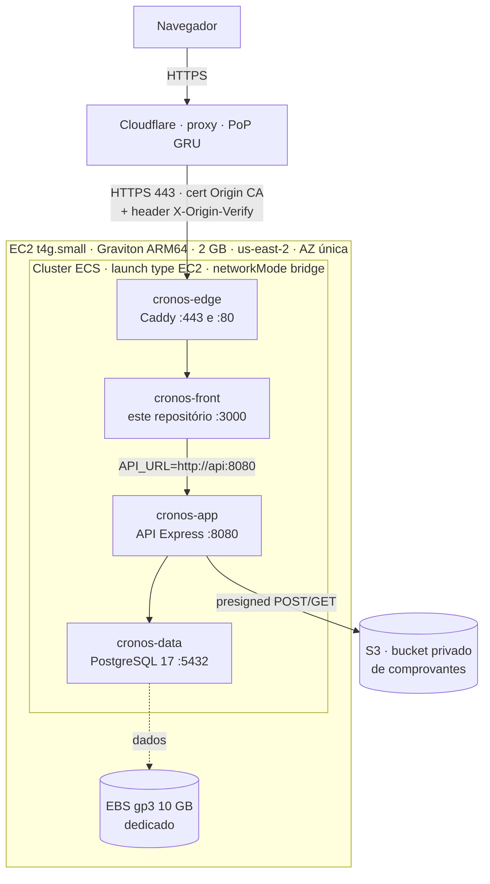

# 🕓 CRONOS — Sistema de Controle de Despesas

> _"O amigo que te ajuda a controlar suas despesas!"_

Aplicação web para **controle colaborativo de despesas de uma casa compartilhada**. Cada usuário cria ou entra em uma **residência**, os membros lançam suas despesas ao longo do mês, e o sistema consolida tudo por competência: total por membro, relatórios por categoria, comparativo entre meses e o **rateio** que aponta quem paga e quem recebe para todos ficarem quites.

Este repositório contém o **front-end**. O back-end vive em um projeto separado: [`sistema-controle-despesas-api`](https://github.com/gbrlmzl/sistema-controle-despesas-api), e a infraestrutura em [`sistema-controle-despesas-deploy`](https://github.com/gbrlmzl/sistema-controle-despesas-deploy).

Em produção o sistema roda em **`https://cronos.gabrielmizael.com`** — ECS sobre uma única instância EC2 Graviton, atrás da Cloudflare. Ver [Arquitetura na AWS](#-arquitetura-na-aws).

---

## 📑 Índice

- [Arquitetura geral](#-arquitetura-geral)
- [Funcionalidades](#-funcionalidades)
- [Stack & Tecnologias](#-stack--tecnologias)
- [Estrutura do front-end](#-estrutura-do-front-end)
- [Rotas do front-end](#-rotas-do-front-end)
- [Autenticação e sessão](#-autenticação-e-sessão)
- [API REST](#-api-rest)
- [Modelo de dados](#-modelo-de-dados)
- [Regras de negócio](#-regras-de-negócio)
- [Testes](#-testes)
- [Como rodar](#-como-rodar)
- [Variáveis de ambiente](#-variáveis-de-ambiente)
- [Convenções de código](#-convenções-de-código)
- [Build de produção (Docker)](#-build-de-produção-docker)
- [Arquitetura na AWS](#-arquitetura-na-aws)
- [Documentação complementar](#-documentação-complementar)
- [Pendências conhecidas](#-pendências-conhecidas)

---

## 🏗️ Arquitetura geral

Na V1 o projeto era um monolito Next.js (Route Handlers + Server Actions + Prisma no mesmo repositório). Na **V2.0** o back-end foi extraído para uma **API Express independente**, e o Next.js passou a ser um consumidor dela — mantendo, porém, SSR e React Server Components. A decisão e as alternativas consideradas estão em [`docs/decisao-arquitetura-frontend.md`](docs/decisao-arquitetura-frontend.md).

```
┌───────────────┐   /api/:path*      ┌──────────────────┐   Prisma    ┌────────────┐
│   Navegador   │ ─── proxy runtime ►│  Next.js (front) │ ──────────► │            │
│               │                    │   :3000          │  fetch      │            │
│  cookies do   │ ◄──────────────────│                  │ ──────────► │ API Express│ ──► PostgreSQL
│  domínio do   │                    └──────────────────┘             │   :8080    │
│    front      │                                                     └────────────┘
└───────────────┘
```

Dois pontos que definem essa integração:

- **Proxy same-origin.** O navegador nunca fala direto com a API. O Route Handler em [`src/app/api/[...path]/route.ts`](<src/app/api/[...path]/route.ts>) encaminha as chamadas do cliente para a API, lendo `process.env.API_URL` a cada requisição — não em build-time (um `rewrite` anterior resolvia esse endereço em build, congelado em `routes-manifest.json`, e causou uma indisponibilidade em produção antes de ser substituído por este mecanismo). Assim não há CORS no navegador e os cookies de sessão pertencem ao domínio do front — o que é essencial para o [`src/proxy.ts`](src/proxy.ts) conseguir enxergá-los.
- **Server Components chamam a API direto.** Páginas e Server Actions usam [`lib/apiClient.ts`](src/lib/apiClient.ts), que fala com a API server-to-server e repassa os cookies manualmente (o `fetch` do servidor não faz isso sozinho para outra origem).

---

## ✨ Funcionalidades

Organizadas pelos épicos do [documento de requisitos da V2.0](docs/release-v2.0-requisitos.md).

### Conta e identidade

| Funcionalidade | Descrição |
|---|---|
| **Cadastro e login** | Conta com nome, `username`, e-mail e senha. O **login é feito pelo `username`**, não pelo e-mail. |
| **Login com Google** | OAuth via Google (opcional — a API funciona sem ele). Gera um `username` automático a partir do e-mail. |
| **Recuperação de senha** | Link por email (`/forgot-password` → `/change-password`), sem abrir sessão ao final — o usuário faz login com a senha nova. Resposta sempre `200`, mesmo para email inexistente (anti-enumeração). |
| **Identificador público (`username`)** | Campo único e público que permite convidar alguém sem expor o e-mail. |
| **Perfil** | Edição do nome e escolha entre **20 avatares SVG**; conta Google traz a foto da conta. |
| **Alterar senha** | Só para contas com senha local (contas só-Google não têm o que trocar). |
| **Tema claro / escuro** | Alternância pelo botão de sol/lua do [`AppShell`](src/components/layout/AppShell.tsx). O escuro é o tema original e o padrão; a escolha fica em `localStorage` e é aplicada por um script inline antes da hidratação, para não piscar. |

### Residências

| Funcionalidade | Descrição |
|---|---|
| **Criar residência** | Nome livre; o sistema gera um **código curto e único** que identifica a casa. |
| **Listar residências** | Todas as residências das quais o usuário é membro, com criador e ação de copiar o código. |
| **Painel da residência** | Visão geral com resumo do mês, membros e atalhos para despesas e relatórios. |
| **Renomear / arquivar** | Só o owner. Residência arquivada fica **somente leitura**. |
| **Sair da residência** | Membro sai por vontade própria; o owner precisa **transferir a propriedade** antes. |
| **Remover membro** | Só o owner, e nunca a si mesmo. |
| **Transferir propriedade** | Passa o papel de owner para outro membro, em transação única. |
| **Regenerar código** | Invalida o código anterior (útil se ele vazou) e derruba as solicitações pendentes. |

### Acesso: convites e solicitações

Dois fluxos simétricos de entrada:

| Fluxo | Como funciona |
|---|---|
| **De fora para dentro** — solicitação | O usuário digita o **código** da residência e gera uma solicitação, que o owner aceita ou recusa. |
| **De dentro para fora** — convite | O owner convida alguém pelo **`username`**; o convidado aceita ou recusa. Convites expiram em **7 dias**. |

Complementos: **cancelamento** pelo próprio autor enquanto pendente, **central de notificações** (sino no `AppShell` + tela dedicada) e **proteção contra tentativa em massa** de códigos.

Do lado de dentro, convites enviados e solicitações recebidas moram em uma **tela própria** (`/dashboard/residences/[code]/members/requests`), separada da gestão de membros. Do lado de fora, as pendências do próprio usuário (convites recebidos e solicitações enviadas) aparecem na lista de residências.

### Despesas colaborativas

| Funcionalidade | Descrição |
|---|---|
| **Lançar despesa** | Qualquer membro lança, de forma incremental, a qualquer momento do mês. Valor guardado **em centavos**. O formulário é um **modal** aberto pelo botão `+` do `AppShell`, disponível de qualquer rota da residência — não há mais uma rota `/new` para despesa. |
| **Categoria** | Obrigatória, com cinco valores fixos: Alimentação, Contas domésticas, Assinaturas, Lazer e Outros. |
| **Consultar por competência** | Agrupamento por membro, com total por membro e total geral, navegando entre meses. |
| **Editar / excluir** | Apenas os próprios lançamentos, com exclusão lógica (`deletedAt`). |
| **Despesa recorrente** | Marcada para ser recriada na competência seguinte quando o owner fecha o mês. Tela dedicada de gestão. |
| **Fechar / reabrir mês** | O owner fecha a conta do mês; a competência fechada fica somente leitura e a aberta passa a ser a seguinte. |
| **Acertos de pagamento** | No fechamento, o rateio vira **pares** devedor→credor (simplificação de dívidas). O devedor liquida anexando comprovante (compressão no navegador, upload direto ao S3); o credor liquida confirmando o recebimento — sem ordem obrigatória entre os dois. O owner pode dispensar uma linha, com motivo. |

### Relatórios e análise

| Funcionalidade | Descrição |
|---|---|
| **Relatório por categoria** | Quanto foi gasto em cada categoria, em duas abas: **da residência** e **pessoal**. |
| **Comparativo entre meses** | Variação absoluta e percentual entre duas competências, no total e por categoria. |
| **Gráficos** | Composição por categoria e evolução das últimas 6 competências (Recharts). |
| **Rateio entre membros** | Divisão igual do total entre os membros atuais, apontando quem paga e quem recebe. |
| **Média e variação** | Compara a competência atual com a média das 3 anteriores, sinalizando desvios. |
| **Exportar CSV** | Baixa os lançamentos da competência em planilha pronta para o Excel em português. |
| **Compartilhar imagem** | Gera um PNG do resumo do mês (SVG desenhado à mão → canvas) para enviar no grupo da casa. |

---

## 🧰 Stack & Tecnologias

### Front-end (este repositório)

| Camada | Tecnologia |
|---|---|
| **Framework** | Next.js 16 (App Router, Turbopack) + React 19 |
| **Linguagem** | TypeScript (`strict`) |
| **Estilo** | CSS Modules + `modern-css-reset` + `next/font`, sobre design tokens semânticos em `globals.css` (temas por `[data-theme]`) |
| **Validação** | Zod 4 |
| **Gráficos** | Recharts 3 |
| **Ícones** | SVG inline em [`components/layout/Icones.tsx`](src/components/layout/Icones.tsx) — herdam `currentColor` e acompanham o tema |
| **Datas** | date-fns, react-datepicker |
| **Testes** | Jest 30 + Testing Library + `next/jest` (SWC); Cypress 15 para E2E |

### API ([repositório separado](https://github.com/gbrlmzl/sistema-controle-despesas-api))

| Camada | Tecnologia |
|---|---|
| **Runtime** | Node.js 24 + Express 5 |
| **Linguagem** | TypeScript (ESM), executado com `tsx` em dev |
| **ORM / Banco** | Prisma 7 + PostgreSQL (adapter `@prisma/adapter-pg`) |
| **Autenticação** | JWT (`jsonwebtoken`) + refresh token rotativo + Passport (Google OIDC) |
| **Hash de senha** | bcrypt |
| **Validação** | Zod 4 |
| **Testes** | Jest 30 + Supertest (unitários + integração) |

---

## 📁 Estrutura do front-end

```
src/
├── app/
│   ├── layout.tsx                  # Root layout: fontes, ThemeProvider, UserProvider (resolve a sessão)
│   ├── globals.css                 # Design tokens (cores por [data-theme], raios, fontes)
│   ├── page.tsx / Inicio.tsx       # Landing page
│   ├── error.tsx / global-error.tsx
│   ├── api/[...path]/route.ts      # Proxy same-origin do navegador para a API
│   ├── (auth)/                     # Route group das telas SEM sessão (moldura própria, sem navegação)
│   │   ├── login/  register/       # Autenticação
│   │   └── forgot-password/  change-password/
│   ├── profile/                    # Minha conta: perfil, avatares e settings/password/
│   └── dashboard/                  # Área autenticada — layout.tsx envolve tudo no AppShell
│       ├── page.tsx                # Redireciona para /dashboard/residences
│       ├── alerts/                 # Central de notificações
│       └── residences/
│           ├── page.tsx            # Lista + pendências de acesso do usuário
│           ├── new/  join/         # Criar / entrar por código
│           └── [code]/             # Contexto da residência
│               ├── page.tsx        # Painel + Server Actions da residência (*Action.ts)
│               ├── members/        # Gestão de membros (+ requests/: convites e solicitações)
│               ├── settings/       # Renomear, arquivar, regenerar código
│               ├── expenses/       # Consulta por competência e recorrentes (recurring/)
│               ├── settlements/    # Acertos de pagamento (comprovantes, dispensa)
│               └── reports/        # Relatórios e gráficos
├── components/
│   ├── layout/AppShell.tsx         # Casca da área autenticada: rail no desktop, header/tab bar no mobile
│   ├── layout/Icones.tsx           # Ícones SVG inline (+ IconesCategoria.tsx)
│   ├── providers/UserProvider.tsx  # Contexto de "quem está logado" (substitui o useSession)
│   ├── providers/ThemeProvider.tsx # Tema claro/escuro via <html data-theme> + localStorage
│   ├── despesas/                   # CadastrarDespesaModal, SeletorCategoria
│   └── ui/                         # Snackbar, Loading, SinoNotificacoes
├── hooks/                          # useLogin, useLogout, useProfile, useResidencias, useAlertas,
│                                   # useNotificacoes, useCompetenciaAberta, useEsqueciSenha, useRedefinirSenha
├── lib/
│   ├── apiClient.ts                # Cliente HTTP server-side (repassa cookies, retry de refresh)
│   ├── apiClient.client.ts         # Cliente HTTP client-side (refresh deduplicado + cooldown)
│   ├── apiError.ts                 # ApiError + parse do envelope de erro
│   ├── session.ts                  # getCurrentUser() — substitui o auth() do NextAuth
│   ├── setCookie.ts                # Parse de Set-Cookie (usado pelo proxy.ts no Edge)
│   ├── expensesApi.ts / reportsApi.ts / residenceApi.ts / acertosApi.ts
│   └── avatars.ts / residenceCode.ts
├── schemas/                        # Schemas Zod (despesas, residências, usuários)
├── types/                          # Tipos compartilhados (auth, residencia, competencia, acerto, …)
├── utils/                          # dinheiro (centavos), competencia, categorias, csv, resumoImagem,
│                                   # formatarMomento, acerto, comprimirImagem, converterParaPng, linkNotificacao
└── proxy.ts / proxy.test.ts        # Guarda de rota + renovação de sessão (middleware do Next.js)

public/
├── avatars/                        # avatar-01.svg … avatar-20.svg
└── icons/  fonts/  assets/
```

Cada página é um **Server Component** que busca dados via `lib/*Api.ts` e delega a interação a um Client Component irmão. As mutações são **Server Actions** (arquivos `*Action.ts`), que validam com Zod, chamam a API e disparam `revalidatePath`.

Três áreas, três molduras: a landing tem cabeçalho próprio, `(auth)` não tem navegação nenhuma (quem chega ali ainda não tem sessão) e `/dashboard` + `/profile` compartilham o [`AppShell`](src/components/layout/AppShell.tsx) — que troca de navegação conforme haja ou não um código de residência na URL.

---

## 🗺️ Rotas do front-end

| Rota | Descrição | Protegida |
|---|---|---|
| `/` | Landing page | — |
| `/login` | Login por `username` + senha | só deslogado |
| `/register` | Criação de conta | só deslogado |
| `/forgot-password` | Pede o link de redefinição de senha por email | só deslogado |
| `/change-password` | Redefine a senha a partir do link do email | — (funciona com ou sem sessão, ver F-03 em `docs/plano-recuperacao-de-senha-frontend.md`) |
| `/profile` | Perfil e galeria de avatares | ✅ |
| `/profile/settings/password` | Troca de senha | ✅ |
| `/dashboard` | Redireciona para `/dashboard/residences` | ✅ |
| `/dashboard/alerts` | Histórico de notificações | ✅ |
| `/dashboard/residences` | Lista de residências + pendências | ✅ |
| `/dashboard/residences/new` | Criar residência | ✅ |
| `/dashboard/residences/join` | Entrar por código | ✅ |
| `/dashboard/residences/[code]` | Painel da residência | ✅ |
| `/dashboard/residences/[code]/members` | Gerenciar membros | ✅ |
| `/dashboard/residences/[code]/members/requests` | Convites enviados e solicitações recebidas | ✅ |
| `/dashboard/residences/[code]/settings` | Configurações da residência | ✅ |
| `/dashboard/residences/[code]/expenses` | Consulta por competência | ✅ |
| `/dashboard/residences/[code]/expenses/recurring` | Despesas recorrentes | ✅ |
| `/dashboard/residences/[code]/settlements` | Acertos de pagamento da competência fechada | ✅ |
| `/dashboard/residences/[code]/reports` | Relatórios e gráficos | ✅ |

> As rotas da aplicação viviam sob `/app` (dentro do route group `(auth)`) até a reformulação de UI de 11/08/2026; hoje o prefixo é `/dashboard`, e `(auth)` guarda só as telas de quem ainda não tem sessão.
>
> **O `matcher` do [`src/proxy.ts`](src/proxy.ts) cobre o site inteiro**, não só as rotas protegidas — porque o layout raiz chama `getCurrentUser()` em **toda** página, e o proxy é o único lugar capaz de persistir o cookie renovado. Enquanto a lista era `/dashboard` + `/profile`, `"/"` e `/change-password` caíam no `apiClient.ts`, que queimava o refresh token sem conseguir guardar o valor novo. Ficam de fora só o Route Handler `/api/*`, o `_next/`, os arquivos com ponto no caminho (favicon, sitemap, robots e todo o `public/`) e o prefetch de `<Link>`. **Quem decide o que redireciona para `/login` é a constante `ROTAS_PROTEGIDAS` dentro do arquivo** (`/dashboard` e `/profile`), não o `matcher`.

---

## 🔐 Autenticação e sessão

O NextAuth foi removido na V2.0. Hoje a sessão é inteiramente da API, e o front apenas transporta cookies.

### Os dois tokens

| Token | Formato | Vida | Cookie |
|---|---|---|---|
| **Access token** | JWT stateless (HS256) | 15 min | `JWT` — `httpOnly`, `sameSite: lax` |
| **Refresh token** | Valor opaco aleatório (40 bytes) | 7 dias | `REFRESH` — `httpOnly`, `sameSite: strict` |

O refresh token **não é um JWT de propósito**: ele não carrega claim nenhuma, e o banco é a única fonte de verdade sobre validade. Só o **hash SHA-256** é guardado, nunca o valor em texto puro.

### Rotação com detecção de reuso

Cada refresh gera um token novo e revoga o anterior, todos agrupados por um `familyId` (a cadeia de rotação de um mesmo login). Se um token **já revogado** for apresentado de novo, é sinal de roubo: a **família inteira é revogada**, forçando login novo. Ver `rotateRefreshToken` no `authService` da API.

### Como o front participa

**Renovar a sessão é responsabilidade exclusiva do [`proxy.ts`](src/proxy.ts).** Essa exclusividade é o desenho, não uma coincidência de implementação — a razão está logo abaixo.

```
1. proxy.ts            → decodifica o exp do JWT (sem validar assinatura); se estiver
                         perto de expirar e houver REFRESH, chama POST /auth/refresh
                         ANTES do render e propaga os cookies novos
2. layout.tsx          → getCurrentUser() chama GET /users/me a cada render
3. apiClient.ts        → NÃO renova. Um 401 aqui é sessão realmente encerrada
4. apiClient.client.ts → no navegador, renova em 401 (deduplicado + cooldown de 30s)
```

Quatro detalhes que valem atenção:

- **Renovar durante o render destruía a sessão.** O consumidor mais frequente do `apiClient.ts` é o `getCurrentUser()` do layout raiz, que roda **durante a renderização** de um Server Component — e ali o Next.js proíbe escrever cookie (`cookies().set()` lança). Com refresh token rotativo, um refresh cujo `Set-Cookie` não chega ao navegador não é apenas inútil: ele **revoga o token que o navegador ainda está usando**. A renovação seguinte era lida pela API como reuso — ou seja, roubo — e derrubava a sessão em **todos** os dispositivos, disparando um alerta de segurança falso. Por isso o `apiClient.ts` do servidor não tem mais retry de `/auth/refresh`.
- **O `proxy.ts` não é autorização.** Ele só lê o `exp` do payload do JWT, sem validar assinatura — uma heurística de "provavelmente expirado". A ausência de validação é deliberada e não tem a ver com runtime (o proxy roda em Node desde o Next 16): o segredo de assinatura pertence à API e não deve existir no front. A autorização de verdade é sempre da API, a cada chamada: um cookie presente mas inválido passa pelo proxy e falha depois. Ele é, porém, **o único ponto do fluxo que roda antes do render e onde o Next.js deixa escrever cookie de fato** — daí a renovação morar ali. Os cookies renovados são gravados **tanto na resposta quanto no header `Cookie` do próprio request**, porque o `cookies()` de `next/headers` lê o request, não o `Set-Cookie` do middleware.
- **Prefetch de `<Link>` não renova sessão.** O `matcher` do proxy exclui requisições com os headers de prefetch: o Next dispara vários em paralelo ao passar o mouse ou ao entrar no viewport, e cada um viraria um `POST /auth/refresh` com o **mesmo** token — exatamente a corrida que a API lê como reuso. Navegação de verdade não traz esses headers e continua renovando normalmente.
- **O `apiClient.client` deduplica o refresh**: se duas chamadas tomam 401 ao mesmo tempo, a segunda espera a promise que a primeira já disparou; há um cooldown de 30s após uma falha, para não entrar em loop. No navegador isso é seguro — o `Set-Cookie` da resposta chega ao browser normalmente, que é justamente o que falta no caminho do servidor.

> Do outro lado, a API abre uma **janela de graça de 10 segundos** na rotação: um token recém-rotacionado ainda é aceito nesse intervalo, desde que exista um sucessor vivo na mesma família. É a rede de segurança para as corridas que nenhum controle no cliente resolve sozinho (várias abas, várias instâncias do front). As duas medidas são complementares: o front **evita** disparar renovações concorrentes; a API **tolera** as que escaparem.

---

## 🔌 API REST

Base local: `http://localhost:8080`. Do front, tudo passa por `/api/*` — pelo Route Handler [`src/app/api/[...path]/route.ts`](<src/app/api/[...path]/route.ts>) quando a chamada nasce no navegador, e direto pelo `apiClient` quando nasce em Server Component ou Server Action. Erros sempre respondem `{ message }` com o status apropriado.

### Autenticação — `/auth` (público)

| Método | Rota | Descrição |
|---|---|---|
| `POST` | `/auth/register` | Cria a conta e já estabelece a sessão |
| `POST` | `/auth/login` | Login por `username` + `password` |
| `POST` | `/auth/refresh` | Rotaciona o refresh token e emite novo access token |
| `POST` | `/auth/logout` | Revoga o refresh token e limpa os cookies |
| `POST` | `/auth/forgot-password` | Dispara o email com o link de redefinição (sempre `200`, anti-enumeração) |
| `POST` | `/auth/reset-password/verify` | Valida o token do link antes de mostrar o formulário |
| `POST` | `/auth/reset-password` | Redefine a senha pelo token — **sem** abrir sessão |
| `GET` | `/auth/google` | Início do OAuth _(só se o Google estiver configurado)_ |
| `GET` | `/auth/google/callback` | Callback do OAuth |

### Usuários — `/users` 🔒

| Método | Rota | Descrição |
|---|---|---|
| `GET` | `/users/me` | Usuário da sessão |
| `PATCH` | `/users/me` | Atualiza nome e/ou avatar |
| `PATCH` | `/users/me/password` | Troca a senha (valida a atual) |

### Residências — `/residences` 🔒

| Método | Rota | Descrição |
|---|---|---|
| `GET` | `/residences` | Residências do usuário + pendências de acesso |
| `POST` | `/residences` | Cria residência (gera o código) |
| `GET` | `/residences/:code` | Detalhe + convites enviados + solicitações pendentes |
| `PATCH` | `/residences/:code` | Renomeia / arquiva / desarquiva _(owner)_ |
| `POST` | `/residences/:code/code` | Regenera o código _(owner)_ |
| `POST` | `/residences/:code/invites` | Convida por `username` _(owner)_ |
| `PUT` | `/residences/:code/owner` | Transfere a propriedade _(owner)_ |
| `DELETE` | `/residences/:code/members/me` | Sair da residência |
| `DELETE` | `/residences/:code/members/:userId` | Remove membro _(owner)_ |
| `POST` | `/residences/join-requests` | Solicita entrada por código |
| `PATCH` | `/residences/join-requests/:id` | Aceita / recusa solicitação _(owner)_ |
| `DELETE` | `/residences/join-requests/:id` | Cancela a própria solicitação |
| `PATCH` | `/residences/invites/:id` | Aceita / recusa convite recebido |
| `DELETE` | `/residences/invites/:id` | Cancela convite enviado _(owner)_ |

### Despesas — `/residences/:code/expenses` 🔒

| Método | Rota | Descrição |
|---|---|---|
| `GET` | `/expenses?month=&year=` | Despesas da competência, agrupadas por membro _(sem query: a competência aberta)_. Traz também o bloco `settlement` com "o meu lado" nos acertos |
| `GET` | `/expenses/competencies` | Competências disponíveis para navegação no seletor |
| `POST` | `/expenses` | Lança despesa na competência aberta |
| `PATCH` | `/expenses/:expenseId` | Edita a própria despesa |
| `DELETE` | `/expenses/:expenseId` | Exclui (lógico) a própria despesa |
| `GET` | `/expenses/recurring` | Recorrentes do próprio usuário |
| `DELETE` | `/expenses/:expenseId/recurrence` | Para a recorrência sem excluir o lançamento |
| `POST` | `/expenses/month-closures` | Fecha o mês _(owner)_ |
| `DELETE` | `/expenses/month-closures/:period` | Reabre o mês _(owner)_ |

### Acertos de pagamento — `/residences/:code/closures/:period` 🔒

`:period` é a competência no formato `AAAA-MM` (ex.: `2026-08`). Só existe para competência **fechada**: período aberto (ou usuário que não é membro) responde `404`, e o front trata como `notFound()`.

| Método | Rota | Descrição |
|---|---|---|
| `GET` | `/settlements` | Pares devedor→credor da competência, com totais, comprovantes e o que o usuário pode fazer (`canAct` / `canUpload`) |
| `POST` | `/settlements/:id/confirm` | O credor confirma o recebimento |
| `POST` | `/settlements/:id/waive` | O owner dispensa a linha, com motivo |
| `POST` | `/settlements/:id/receipts` | Pede a URL pré-assinada de upload (envia `contentType`, `sizeInBytes`, `originalName`) |
| `POST` | `/settlements/:id/receipts/:receiptId/complete` | Confirma o upload concluído e marca a linha como paga |
| `GET` | `/receipts/:receiptId/url` | URL temporária para visualizar um comprovante |

O arquivo em si **não passa pela API**: o navegador comprime a imagem (PDF passa direto), pede a URL pré-assinada, faz `POST` do form direto ao S3 e só então chama `/complete`.

### Relatórios e notificações 🔒

| Método | Rota | Descrição |
|---|---|---|
| `GET` | `/residences/:code/reports?month=&year=&tab=` | Relatório da competência. `tab` = `residence` (padrão) ou `personal` |
| `GET` | `/notifications` | Notificações do usuário (paginadas) |
| `PATCH` | `/notifications` | Marca notificações como lidas |
| `GET` | `/health` | Liveness — não toca o banco (público) |
| `GET` | `/ready` | Readiness — faz `SELECT 1`; `503` quando o banco não responde (público) |

---

## 🗄️ Modelo de dados

PostgreSQL via Prisma. O schema vive na API (`prisma/schema.prisma`).

```
User ──< UserAuthProvider          (provedores de login: local | google)
 │  └──< RefreshToken              (sessões, com rotação por familyId)
 │
 ├──< Membership >── Residence     (N:N com papel OWNER | MEMBER)
 ├──< Invite      >── Residence    (convite: de dentro para fora)
 ├──< JoinRequest >── Residence    (solicitação: de fora para dentro)
 ├──< Expense     >── Residence    (lançamento numa competência)
 ├──< MonthClosure>── Residence    (fechamento do mês)
 ├──< Notification                 (avisos genéricos)
 └──< JoinAttempt                  (rate limit de entrada por código)
```

| Model | Campos-chave | Observações |
|---|---|---|
| **User** | `name`, `email` (único), `username` (único), `password?`, `profilePic?` | `password` nulo em contas só-Google. `username` é o identificador **público** e o login. |
| **RefreshToken** | `tokenHash` (único), `familyId`, `expiresAt`, `revokedAt?` | Nunca guarda o token em texto puro. |
| **Residence** | `name`, `code` (único), `ownerId`, `archivedAt?` | Arquivada = somente leitura. |
| **Membership** | `userId` + `residenceId` (único), `role` | `OWNER` \| `MEMBER`. |
| **Invite** / **JoinRequest** | `status`, `expiresAt` (convite), `respondedAt?` | `PENDING` \| `ACCEPTED` \| `DECLINED` \| `CANCELLED` \| `EXPIRED`. |
| **Expense** | `name`, **`valueInCents`**, `category`, `month`, `year`, `isRecurring`, `deletedAt?` | Valor **em centavos**: ponto flutuante acumularia erro na soma e o rateio depende de totais exatos. |
| **MonthClosure** | `residenceId` + `year` + `month` (único), `closedById` | Fechamento da conta do mês. |
| **Notification** | `type`, `title`, `message`, `linkTo?`, `readAt?` | Catálogo extensível; qualquer área publica aqui. |
| **JoinAttempt** | `userId`, `createdAt` | Contador persistido, para sobreviver a restart e múltiplas instâncias. |

**Enums:** `MembershipRole`, `AccessStatus`, `ExpenseCategory` (`ALIMENTACAO`, `DOMESTICAS`, `ASSINATURAS`, `LAZER`, `OUTROS`) e `NotificationType` (convite recebido, solicitação recebida/aceita/recusada, membro removido, propriedade transferida, mês fechado).

**Acertos.** O fechamento do mês passou a gerar também as linhas de acerto, penduradas no `MonthClosure`. O schema fica na API; o contrato que este repositório consome está tipado em [`src/types/acerto.ts`](src/types/acerto.ts):

- Uma linha por **par** devedor→credor (nunca por pessoa: quem deve para dois membros aparece em duas linhas), com `payer`, `receiver`, `amountInCents`, `paidAt`, `confirmedAt`, `waivedAt` e `waiveReason`.
- Status da linha: `PENDING` → `AWAITING_CONFIRMATION` → `SETTLED`, ou `WAIVED` quando o owner dispensa. O fechamento inteiro tem o seu próprio status agregado (`AWAITING_PAYMENT`, `AWAITING_CONFIRMATION`, `SETTLED`).
- Cada linha guarda os **comprovantes** enviados (`contentType`, `sizeInBytes`, `originalName`, `uploadedAt`, `uploadedByName`) — o binário fica no S3, não no banco.
- Fechamento antigo, anterior à funcionalidade, devolve a lista vazia em vez de `404`.

---

## 📋 Regras de negócio

As regras (`RN-XXX`) são catalogadas em [`docs/release-v2.0-requisitos.md`](docs/release-v2.0-requisitos.md) e referenciadas em comentários no código da API. As mais estruturantes:

### Competência (mês/ano)

- **A competência aberta é o mês corrente**; se o owner já o fechou, passa a ser o seguinte (RN-020).
- Toda despesa cai **sempre na competência aberta** — nunca numa escolhida pelo cliente.
- Reabrir um mês passado o destrava para edição, mas **não muda** onde os novos lançamentos caem.

### Acesso e visibilidade

- Só membros veem uma residência. Quem não é membro recebe **404**, igual a residência inexistente (RN-009 / RN-010) — não dá para descobrir se um código existe.
- Uma solicitação recusada só pode ser refeita **depois de uma hora** (RN-013).
- Convites expiram em **7 dias** (RN-015).
- **10 tentativas** malsucedidas de código em 15 minutos bloqueiam por 15 minutos, contadas **por usuário autenticado** (RN-049 / RN-051).
- Regenerar o código derruba as solicitações pendentes (nasceram do código antigo), mas **não toca nos membros atuais** (RN-047 / RN-048).

### Propriedade e saída

- O owner **não pode sair** sem antes transferir a propriedade — a residência nunca fica sem dono (RN-021 / RN-017).
- A transferência acontece em **transação única**, para nunca haver zero ou dois owners.
- Quem sai (ou é removido) **leva junto os lançamentos da competência aberta** (RN-022 / RN-026), para o rateio não ficar inflado por gastos de quem não está mais na casa.

### Rateio e relatórios

- Divisão **igual** do total pelo número de membros atuais (FEAT-029).
- A sobra da divisão em centavos é distribuída **de um em um centavo** entre os primeiros participantes (RN-066) — assim a soma das cotas bate com o total e a soma dos saldos dá exatamente zero.
- Lançamentos excluídos ficam de fora do relatório (RN-057).
- O gráfico de evolução mostra as **últimas 6 competências** (RN-062); a média usa as **3 anteriores** (RN-068).
- A aba pessoal olha **só para a residência atual**, nunca soma as outras (RN-060).

---

## 🧪 Testes

### Front-end

Jest 30 + Testing Library, com a transformação via **`next/jest`** — que usa o mesmo SWC do Next.js, sem Babel. A configuração já cobre CSS Modules, imagens, `next/font` e o alias `@/*`.

```bash
npm test
```

| Arquivo | Papel |
|---|---|
| [`jest.config.ts`](jest.config.ts) | Config via `nextJest({ dir })` + `moduleNameMapper` do alias e `testEnvironment: jsdom` |
| [`jest.setup.ts`](jest.setup.ts) | Importa `@testing-library/jest-dom` |
| `.env.test` | Necessário porque o Next.js **não carrega `.env.local` em `NODE_ENV=test`**, e o `next.config.ts` exige `API_URL` |

> Testes ficam junto do código, em arquivos `*.test.tsx` / `*.spec.tsx` ou dentro de `__tests__/`.

O [`src/proxy.test.ts`](src/proxy.test.ts) merece nota à parte: além dos caminhos de guarda de rota e renovação, ele **assere o `matcher`** — que a expressão cobre a landing e o `/change-password`, que não cobre `/api/*` nem estáticos, e que ignora o prefetch de `<Link>`. É a única proteção automatizada contra um refactor silencioso naquela configuração, cujo erro não aparece em nenhuma outra suíte: uma rota fora do matcher não quebra o build nem a página — ela só deixa de renovar a sessão, e o sintoma vira logout aparentemente aleatório.

O plano de ampliação de cobertura — o que vale testar e em que ordem — está em [`docs/plano-cobertura-testes.md`](docs/plano-cobertura-testes.md); o catálogo de casos, em [`docs/backlog-e-casos-de-teste.md`](docs/backlog-e-casos-de-teste.md).

### E2E (Cypress)

Os specs vivem em [`cypress/e2e/`](cypress/e2e) e rodam **contra um build de produção** na porta `3100`, não contra o dev server: em dev com Turbopack a hidratação de algumas rotas às vezes não termina a tempo, e cliques do Cypress passam silenciosamente sem efeito. A API precisa estar no ar.

```bash
npm run test:e2e        # build + next start -p 3100 + cypress run
npm run test:e2e:fast   # o mesmo, reaproveitando o build existente
npm run test:e2e:open   # abre a interface do Cypress
```

| Spec | Fluxo coberto |
|---|---|
| `criar-conta.cy.ts` / `recuperar-senha.cy.ts` | Cadastro e recuperação de senha |
| `perfil-e-logout.cy.ts` | Perfil, avatares e saída da sessão |
| `criar-residencia.cy.ts` / `entrar-residencia-codigo.cy.ts` | Criação e entrada por código |
| `convite-membro.cy.ts` / `gerenciar-membros.cy.ts` | Convites, solicitações e gestão de membros |
| `painel-residencia.cy.ts` / `configuracoes-residencia.cy.ts` | Painel e configurações da residência |
| `lancar-despesa.cy.ts` / `editar-excluir-despesa.cy.ts` / `despesa-recorrente.cy.ts` | Ciclo de vida das despesas |
| `fechar-reabrir-mes.cy.ts` / `acertos-de-pagamento.cy.ts` | Fechamento do mês e acertos |
| `relatorios-residencia.cy.ts` / `central-notificacoes.cy.ts` | Relatórios e central de notificações |

> No CI, esses specs **não rodam neste repositório** — quem os executa é o repositório de deploy, contra a stack completa. Ver [Onde o E2E roda](#onde-o-e2e-roda).

### API

Jest + Supertest, separados em `tests/unit` (services e schemas) e `tests/integration` (rotas de ponta a ponta).

```bash
npm test
```

---

## 🚀 Como rodar

São **dois processos** — a API precisa estar no ar para o front funcionar.

> **Caminho mais curto:** o repositório da API tem `docker-compose.yml` próprio, que sobe o Postgres, aplica as migrations e serve a API de uma vez. Com ele no ar, pule direto para o passo 3. O passo a passo manual abaixo continua válido para quem quer rodar a API fora de container. Para subir o sistema **inteiro** (front + API + banco) num comando só, use o [`sistema-controle-despesas-deploy`](https://github.com/gbrlmzl/sistema-controle-despesas-deploy).

### 1. Banco de dados

Um PostgreSQL acessível. A forma mais rápida:

```bash
docker run --name cronos-db -e POSTGRES_PASSWORD=postgres -e POSTGRES_DB=sistema_controle_despesas -p 5432:5432 -d postgres:17-alpine
```

### 2. API

```bash
cd ../sistema-controle-despesas-api
npm install
cp .env.example .env    # preencha DATABASE_URL e JWT_SECRET
npx prisma migrate dev  # aplica as migrations e gera o client
npm run dev             # sobe em http://localhost:8080
```

> `JWT_SECRET` precisa de no mínimo 32 caracteres. Gere um com:
> ```bash
> node -e "console.log(require('crypto').randomBytes(32).toString('hex'))"
> ```

### 3. Front-end

```bash
npm install
cp .env.example .env.local   # ajuste API_URL para a porta onde a API subiu
npm run dev                  # sobe em http://localhost:3000
```

### Scripts

| Projeto | Script | Ação |
|---|---|---|
| **Front** | `npm run dev` | Servidor de desenvolvimento (Turbopack) |
| | `npm run build` / `npm start` | Build e servidor de produção |
| | `npm run start:e2e` | Servidor de produção na porta `3100`, usada pelo Cypress |
| | `npm run lint` | ESLint |
| | `npm test` | Jest |
| | `npm run test:watch` | Jest em modo watch |
| | `npm run test:coverage` | Jest com relatório de cobertura (o que o CI roda) |
| | `npm run test:low-cost` | Jest em série (`--runInBand`), para máquina com pouca memória |
| | `npm run test:e2e` / `test:e2e:fast` / `test:e2e:open` | Cypress contra o build de produção (ver "Testes") |
| | `npm run cypress:run` / `cypress:open` | Cypress avulso, contra um servidor já no ar |
| **API** | `npm run dev` | `tsx watch` em `src/server.ts` |
| | `npm run build` / `npm start` | Compila para `dist/` e executa |
| | `npm test` | Jest (unitários + integração) |
| | `npm run prisma:generate` | Gera o Prisma Client |

---

## 🔑 Variáveis de ambiente

### Front-end

| Variável | Descrição |
|---|---|
| `API_URL` | URL base da API. Lida em **runtime**, a cada requisição, pelos três consumidores: o Route Handler [`src/app/api/[...path]/route.ts`](<src/app/api/[...path]/route.ts>) (chamadas do navegador), [`src/lib/apiClient.ts`](src/lib/apiClient.ts) (Server Components/Actions) e [`src/proxy.ts`](src/proxy.ts) (guarda de rota). **Obrigatória** — os três lançam erro na primeira chamada se ela estiver vazia. |

Definida em `.env.local` (desenvolvimento) e `.env.test` (testes, versionado por não conter segredo).

**Em produção**, `API_URL` é lida do **ambiente do container em runtime** — trocar de API alvo é só mudar a variável e reiniciar o processo, sem rebuild. (Até 21/08/2026, o caminho do navegador passava por um `rewrite` do Next resolvido em **build-time**, congelado em `routes-manifest.json`; foi a causa de uma indisponibilidade em produção, corrigida trocando o rewrite pelo Route Handler acima.) No ECS o valor é:

```
API_URL=http://api:8080
```

Esse `api` não é DNS: é uma linha de `/etc/hosts` escrita pelo campo `extraHosts` da task definition, apontando para o gateway da bridge do Docker. Ver [Arquitetura na AWS](#-arquitetura-na-aws) — é uma constante da arquitetura, não algo que varia por ambiente.

**Detalhe de build que sobrevive à mudança acima:** o `next build` ainda precisa de `API_URL` **presente** (não necessariamente correta) durante a etapa "Collecting page data" — o Next avalia o módulo de cada rota nessa etapa, e o Route Handler (como `apiClient.ts` e `proxy.ts`) lança erro se a variável estiver vazia. É só um guard de "não suba sem isso"; o valor usado no build não influencia o comportamento da imagem publicada, então o [`Dockerfile`](Dockerfile) e o [`ci.yml`](.github/workflows/ci.yml) passam um placeholder via `--build-arg` — e a antiga **Repository Variable** `API_URL` do GitHub deixou de ser necessária.

> ⚠️ **`API_URL` precisa existir no ambiente do container em runtime**, não só como `--build-arg`. Os três consumidores (Route Handler, `apiClient.ts`, `proxy.ts`) lançam `Error: Variável de ambiente API_URL não configurada.` na primeira chamada se ela estiver ausente — e como `proxy.ts` roda a cada requisição para renovar a sessão, essa falha vira **toda página retornando 500**.

### API

| Variável | Padrão | Descrição |
|---|---|---|
| `DATABASE_URL` | — | **Obrigatória.** Conexão do PostgreSQL. |
| `JWT_SECRET` | — | **Obrigatória.** Mínimo de 32 caracteres. |
| `PORT` | `8080` | Porta do servidor. |
| `NODE_ENV` | `development` | `development` \| `test` \| `production`. |
| `FRONTEND_URL` | `http://localhost:3000` | Origem do front (CORS com credenciais + redirect do OAuth). |
| `JWT_EXPIRES_IN` | `15m` | Vida do access token. |
| `REFRESH_TOKEN_EXPIRES_IN` | `7d` | Vida do refresh token. |
| `GOOGLE_CLIENT_ID`<br>`GOOGLE_CLIENT_SECRET`<br>`GOOGLE_CALLBACK_URL`<br>`COOKIE_SESSION_SECRET` | — | Login com Google. **Opcionais, mas tudo ou nada.** Sem elas a API sobe normalmente só com login por credenciais, e `/auth/google` sequer é registrada. |
| `SMTP_HOST`<br>`SMTP_PORT`<br>`SMTP_USER`<br>`SMTP_PASSWORD`<br>`MAIL_FROM` | — | Envio de email. **Tudo ou nada.** Sem elas a recuperação de senha completa o fluxo e o "envio" só vai para o log. |
| `S3_REGION`<br>`S3_BUCKET` | — | Comprovantes de pagamento. **Tudo ou nada.** Sem as duas, só as rotas de comprovante respondem `503` — listar acertos, confirmar recebimento e dispensar continuam de pé. |

A tabela acima é o recorte que importa para quem sobe o sistema; a lista completa (tetos de rate limit, validade dos links de redefinição, expiração das URLs pré-assinadas) está no [README da API](https://github.com/gbrlmzl/sistema-controle-despesas-api#variáveis-de-ambiente).

As variáveis são validadas com Zod na subida ([`src/config/env.ts`](https://github.com/gbrlmzl/sistema-controle-despesas-api/blob/main/src/config/env.ts)): se algo estiver faltando ou malformado, a API falha imediatamente com a mensagem do erro, em vez de quebrar mais tarde.

> ⚠️ **"Tudo ou nada" é literal, e o sintoma em produção é ruim.** Preencher um grupo pela metade não degrada a funcionalidade — **impede a API de subir**, e no ECS isso aparece como task que nunca fica `healthy`, sem relação óbvia com a variável esquecida.

---

## 📐 Convenções de código

- **CSS Modules por componente** (`*.module.css`), com variáveis globais em `globals.css` e fontes injetadas via `next/font` como CSS vars.
- **Design tokens semânticos, não literais** (`--surface`, `--ink`, `--accent` — nunca `--azul`). Os tokens de cor moram em blocos por tema (`:root[data-theme="…"]`), então trocar de tema é reescrever esse bloco, sem tocar em componente nenhum.
- **Ícones são componentes SVG inline** ([`components/layout/Icones.tsx`](src/components/layout/Icones.tsx)), não `` de `public/icons`: herdam `currentColor`, acompanham o tema e não custam uma requisição cada.
- **Server Components buscam, Client Components interagem.** A página resolve os dados e passa para um componente cliente irmão.
- **Mutação é Server Action.** Arquivos `*Action.ts` com `'use server'`, retornando o `ActionState` comum (`{ success, message, data? }`) e chamando `revalidatePath`.
- **Zod em toda entrada**, tanto nas Server Actions quanto nas rotas da API.
- **Dinheiro em centavos** (inteiro) de ponta a ponta; a formatação para exibição fica em `utils/dinheiro.ts`.
- **Exclusão lógica** em `Expense` (`deletedAt`) — leituras sempre filtram `deletedAt: null`.
- **Comentários explicam o porquê, não o quê.** O código da API é denso em comentários que justificam decisões e citam a regra de negócio correspondente.
- Models, rotas e campos em **inglês**; UI, hooks, schemas e mensagens em **português**.

---

## 🐳 Build de produção (Docker)

A imagem de produção ([`Dockerfile`](Dockerfile)) é multi-stage e usa `output: 'standalone'` do Next.js: o build já rastreia e copia só o `server.js` gerado e o subconjunto podado de `node_modules` usado em runtime, em vez do `node_modules` de produção inteiro. Isso derruba o **payload da aplicação** de >1 GB para ~47 MB (medido localmente). A imagem final fecha em ~390 MB no total — o restante é a base `node:24-bookworm-slim` (glibc, necessária pelos binários prebuilt do SWC), que já não muda com o `standalone`. Isso importa porque o destino de deploy (instância `t4g.small`) tem **2 GB de RAM**, divididos com o Postgres (limite de 384 MB) e a API (448 MB).

O entrypoint é `node server.js` (não `npm start`/`next start`) — o `server.js` é gerado pelo próprio Next dentro de `.next/standalone`. O endereço da API **não** fica embutido nele: o Route Handler que faz proxy de `/api/*` lê `API_URL` do ambiente do container a cada requisição (ver seção anterior), então a mesma imagem serve qualquer ambiente — só muda a variável passada na hora de rodar o container.

**A imagem publicada no GHCR é `linux/arm64` puro** ([`ci.yml`](.github/workflows/ci.yml), job `docker-publish`), porque o único destino de deploy hoje é uma instância Graviton (ARM64). Isso significa que:

- Rodar `docker pull ghcr.io/gbrlmzl/sistema-controle-despesas-front` numa máquina x86 (Intel/AMD) só funciona via emulação (QEMU/Rosetta), mais lento.
- Para desenvolvimento local, isso não afeta nada — [`docker-compose.yml`](docker-compose.yml) builda a partir do `Dockerfile.dev` na sua própria arquitetura, não consome a imagem do GHCR.
- Buildar a imagem de produção localmente funciona normalmente em qualquer arquitetura (`docker build --build-arg API_URL=... .`); só a imagem *publicada* é arm64-only.

> A **API** seguiu o caminho oposto e voltou a publicar **manifest multi-arch** (amd64 + arm64). O motivo não é o deploy — é o e2e: ele roda num runner `ubuntu-latest` amd64 e, com só a variante ARM disponível, subia a API inteira emulada por QEMU, onde o bcrypt do cadastro estoura o timeout do Cypress e a suíte falha de forma intermitente. **O front não tem esse problema porque o e2e orquestrado o builda do código-fonte**, na arquitetura do runner, em vez de puxar a imagem publicada.

### Onde o E2E roda

O CI **deste** repositório cobre lint, testes unitários (Jest) e build de produção — os specs do Cypress vivem aqui (`cypress/`), mas não rodam aqui. Depois de publicar a imagem, o job `dispatch` do [`ci.yml`](.github/workflows/ci.yml) avisa o [`sistema-controle-despesas-deploy`](https://github.com/gbrlmzl/sistema-controle-despesas-deploy), que sobe a stack completa (front + API + Postgres) e roda os specs contra ela. Se passarem, aquele repositório re-taggeia **esta mesma imagem** como `:stable` — build once, promote everywhere. Localmente, `npm run test:e2e` continua funcionando contra uma API no host.

---

## ☁️ Arquitetura na AWS

Onde o sistema roda em produção, e o que disso o front precisa saber. As decisões completas — custos, alternativas descartadas e o histórico de cada fase — vivem no repositório de deploy ([`sistema-controle-despesas-deploy/docs/`](https://github.com/gbrlmzl/sistema-controle-despesas-deploy/tree/main/docs)).

> **O que esta seção não traz, de propósito:** ID da conta AWS, o Elastic IP da instância, IDs de instância/security group e o valor de qualquer segredo. O IP em particular **não é detalhe cosmético** — o desenho depende de a origem ser inalcançável fora da borda, e publicá-lo desfaria isso. Nenhum segredo mora em arquivo versionado: tudo vem do SSM Parameter Store.

### A topologia



O sistema inteiro cabe numa **única instância EC2 `t4g.small`** (Graviton, ARM64, 2 GB), num cluster ECS com launch type EC2. São **quatro services, um container cada** — `cronos-edge` (Caddy), `cronos-front` (este repositório), `cronos-app` (API) e `cronos-data` (Postgres). Não há Application Load Balancer: ~US$ 16/mês para distribuir tráfego entre uma instância só não se paga.

**Por que quatro tasks e não uma.** No ECS a task é a unidade atômica de implantação — ele não reinicia um container isolado dentro dela. Com front e API na mesma task, **todo deploy do front reiniciaria a API junto**, e um crash do front (`essential: true`) derrubaria a API com ele. Separar custa US$ 0,00.

### Como o front encontra a API

`networkMode: bridge` com portas fixas no host. O front acha a API pelo **gateway da bridge do Docker**, e a task definition escreve esse endereço no `/etc/hosts` do container via `extraHosts`:

```json
"extraHosts": [{ "hostname": "api", "ipAddress": "<gateway da bridge>" }]
```

É por isso que a variável continua sendo o `API_URL=http://api:8080` de sempre, e não um IP opaco. Três ganhos de graça: a variável é a mesma em qualquer ambiente, quem lê a task definition entende o valor sem comentário, e uma migração futura para Service Connect troca só o `extraHosts` — a variável fica intocada.

> `extraHosts` **não existe** em `networkMode: awsvpc`. Como o desenho usa `bridge`, não há conflito — mas vale saber caso `awsvpc` volte à mesa.

### O que a instância impõe a esta imagem

| Restrição | Consequência aqui |
| --- | --- |
| **Graviton (ARM64)** | A imagem publicada é `linux/arm64`. Uma task amd64 morre com `exec format error` |
| **2 GB de RAM para quatro containers** | O `output: 'standalone'` deixou de ser otimização e virou requisito — ver [Build de produção](#-build-de-produção-docker). O container tem limite **rígido** de 512 MiB: um vazamento no front mata o front, não o Postgres |
| **`readonlyRootFilesystem: true`** | O filesystem raiz é travado (uma RCE não consegue gravar payload), mas o Next **escreve** cache de imagem e de fetch. Daí os `tmpfs` em `.next/cache` e `/tmp` — montados com `uid=1000,gid=1000`, porque o container roda como `USER node` e um `tmpfs` sem dono explícito monta como `root`, fazendo o Next falhar ao escrever no cache que acabamos de montar para ele |
| **Porta fixa no host, `desiredCount=1`** | Obriga `minimumHealthyPercent=0`: a task antiga **sai antes** de a nova entrar. O deploy tem uma janela curta de indisponibilidade, por construção |
| **Health check em `/`** | Com `startPeriod` generoso: falha de healthcheck durante a partida dispara o disjuntor de implantação e mascara a causa real |

### A borda

```
Internet ──HTTPS──▶ Cloudflare ──HTTPS :443──▶ Caddy ──▶ front :3000 ──▶ api :8080
                    (proxy, PoP GRU)  (Origin CA)  (valida X-Origin-Verify)
```

A origem é **fechada**: o Security Group libera a 443 apenas para a prefix list de IPs da Cloudflare, e o TLS até a origem usa um certificado **Origin CA** com a Cloudflare em modo *Full (strict)*. Como essa prefix list libera a Cloudflare **inteira**, uma Transform Rule injeta um header secreto que o Caddy valida — sem ele, qualquer cliente da Cloudflare poderia apontar um proxy para a origem.

A borda ficou na Cloudflare por um motivo direto: o público é brasileiro, e o `PriceClass_100` do CloudFront **exclui** o PoP de São Paulo. Um caminho antigo via CloudFront (porta 80) continua vivo em paralelo, deliberadamente — enquanto os dois servem o mesmo sistema, o rollback é trocar de URL.

Duas coisas que essa montagem cobra do front:

- **Um domínio, não dois.** O proxy same-origin não é preferência estética: cookies de sessão pertencem ao domínio do front, e é isso que permite ao `proxy.ts` enxergá-los. Por consequência, a `GOOGLE_CALLBACK_URL` do OAuth aponta para `https://<domínio>/api/auth/google/callback` — o Route Handler, que remove o prefixo `/api` antes de repassar — e **não** para a rota da API. O Google compara essa string exatamente, sem curinga.
- **Cookies `secure` em produção.** HTTPS de ponta a ponta é requisito, não enfeite: sem borda com TLS, a sessão simplesmente não é gravada.

### Deploy: o que é automático e o que não é

```
push na main ──▶ CI (lint → test → build → publish GHCR) ──▶ dispatch
                                                                │
                    repo de deploy: e2e da stack completa ◀─────┘
                                   │ passou
                                   ▼
                            re-tag :stable no GHCR
                                   │
                  ─────────────────┼─────────  daqui para baixo é manual
                                   ▼
            espelhar :stable → ECR ──▶ update-service cronos-front
```

**Não existe CD para o ECS.** Publicar no GHCR e passar no e2e não coloca nada em produção — o espelhamento para o ECR e o `update-service` são manuais. Duas armadilhas conhecidas desse trecho:

- **Espelhar `:stable`, nunca `:latest`.** O `:latest` é publicado **antes** de o e2e rodar; o `:stable` só existe **depois** que ele passa. Espelhar `:latest` manda para produção um artefato que a validação de ponta a ponta ainda não aprovou.
- **O espelhamento não pode achatar a arquitetura.** Um `docker pull` baixa a arquitetura do host que roda o comando; feito de uma máquina x86, manda uma imagem amd64 para uma instância Graviton. O caminho correto é `docker buildx imagetools create`, que copia os manifests registry→registry sem escolher plataforma.

O front **não recebe variável de ambiente nova** em nenhum desses deploys: a única `process.env` do código é `API_URL`, e ela já está na task definition. Um deploy do front é literalmente trocar a imagem.

### Pendências de infraestrutura

Estado documentado em **29/08/2026** — confira o repositório de deploy antes de agir sobre qualquer item.

| Pendência | Impacto no front |
| --- | --- |
| **Grupos Google OAuth, SMTP e S3 ausentes da task definition da API** | Código pronto nos dois repositórios e inerte em produção: o botão "Continuar com Google" **já aparece na UI** e leva a um 404; a recuperação de senha completa o fluxo **sem enviar o email**; os comprovantes respondem `503`. Nada disso é configurável aqui — as variáveis moram na task da API |
| **`FRONTEND_URL` da API ainda é placeholder** | Cookies `secure` e os links dos emails dependem dele |
| **CORS do bucket de comprovantes sem `GET`** | Quebra **só** o botão de baixar comprovante-imagem, que usa `fetch` para converter em PNG antes de salvar. O PDF sai por navegação (`Content-Disposition: attachment`) e não passa por CORS; a lupa é `` e também não |
| **Espelhamento no ECR e `update-service` manuais** | Merge na `main` com CI verde **não** significa "está no ar" |
| **Sem WAF e sem rate limiting na borda** | Decisão de orçamento. O rate limiting da API é a única proteção contra abuso de rota |
| **`Caddyfile` e certificados não sobrevivem à troca da instância** | Criados à mão no host, fora do versionamento da task definition |

---

## 📚 Documentação complementar

| Documento | Conteúdo |
|---|---|
| [`docs/release-v2.0-requisitos.md`](docs/release-v2.0-requisitos.md) | Backlog completo, estórias de usuário e cenários BDD da V2.0 |
| [`docs/decisao-arquitetura-frontend.md`](docs/decisao-arquitetura-frontend.md) | Por que o Next.js foi mantido em vez de virar SPA com Vite |
| [`docs/plano-api-node-express.md`](docs/plano-api-node-express.md) | Plano de extração da API para Node/Express |
| [`docs/plano-integracao-frontend-api.md`](docs/plano-integracao-frontend-api.md) | Plano de integração do front com a API |
| [`docs/estrategia-tratamento-erros-api.md`](docs/estrategia-tratamento-erros-api.md) | Estratégia de tratamento de erros nas chamadas à API |
| [`docs/migracao-typescript.md`](docs/migracao-typescript.md) | Registro da migração de JavaScript para TypeScript |
| [`docs/decisao-sincronizacao-usuario-pos-acao.md`](docs/decisao-sincronizacao-usuario-pos-acao.md) | Como o usuário do contexto é sincronizado após login/cadastro/logout/perfil, e por que |
| [`docs/refatoracao-contexto-usuario.md`](docs/refatoracao-contexto-usuario.md) | Por que o contexto passou a guardar a *promise* da sessão em vez do usuário resolvido — e como isso destravou os `loading.tsx` |
| [`docs/backlog-e-casos-de-teste.md`](docs/backlog-e-casos-de-teste.md) | Backlog de funcionalidades com cobertura de teste, e documentação de cada caso de teste do front-end |
| [`docs/plano-cobertura-testes.md`](docs/plano-cobertura-testes.md) | Sequência de trabalho para elevar a cobertura, priorizando Server Actions e hooks |
| [`docs/plano-recuperacao-de-senha-frontend.md`](docs/plano-recuperacao-de-senha-frontend.md) | Plano do fluxo de recuperação de senha no front |
| [`docs/plano-registro-de-pagamentos-frontend.md`](docs/plano-registro-de-pagamentos-frontend.md) | Plano do front para o registro e rastreio de pagamentos (base dos acertos) |
| [`docs/funcionalidade-pagamentos.md`](docs/funcionalidade-pagamentos.md) | Proposta de evolução dos pagamentos — **em discussão, nada implementado** |
| [`docs/relatorios/RELATORIO_V1.1.md`](docs/relatorios/RELATORIO_V1.1.md) | Relatório da versão anterior |

---

## ⚠️ Pendências conhecidas

- **O `docker-compose.yml` deste repositório só sobe o front** — e isso é uma decisão, não uma limitação: a API tem compose próprio, que sobe ela junto com o Postgres dela. Ver "Como rodar" acima para as três formas de subir o sistema.
- **Épico de administração e auditoria** (papel ADMIN, trilha de auditoria, monitoramento de acessos) está fora do escopo da V2.0 e não iniciado.
- **As pendências de infraestrutura** — variáveis de Google OAuth, SMTP e S3 ausentes em produção, CORS do bucket, deploy manual — estão em [Arquitetura na AWS → Pendências de infraestrutura](#pendências-de-infraestrutura). Nenhuma delas é configurável neste repositório.

### Resolvidas, e por que ficam registradas

Duas quebras de produção de 20-21/08/2026 moldaram partes do desenho atual. Ficam aqui porque o código carrega as cicatrizes, e removê-las tornaria decisões estranhas incompreensíveis:

- ~~**O rewrite `/api/*` congelado em build-time.**~~ O `rewrite` de `next.config.ts` deu lugar ao Route Handler [`src/app/api/[...path]/route.ts`](<src/app/api/[...path]/route.ts>), que lê `API_URL` em runtime a cada requisição. A imagem deixou de carregar a topologia da rede e passou a servir qualquer ambiente sem rebuild. **É a razão de o `next.config.ts` hoje conter só o `output: 'standalone'`** — e de o `API_URL` do build ser um placeholder assumido.
- ~~**A porta da API (`3001`) diferia da do front (`3000`) em um dígito.**~~ A API foi padronizada em **`8080`** em todo o repositório. Em produção isso implica `API_URL=http://api:8080` na task do front e `PORT=8080` na da API: **mudar uma só derruba a integração**, e as duas moram no [repositório de deploy](https://github.com/gbrlmzl/sistema-controle-despesas-deploy).
- ~~**Renovação de sessão espalhada entre `proxy.ts` e `apiClient.ts`.**~~ O `apiClient.ts` do servidor renovava em 401 sem conseguir persistir o cookie, queimando um refresh token rotativo a cada tentativa — o que a API lia como reuso e tratava como roubo, deslogando o usuário de todos os dispositivos. Hoje renovar é responsabilidade **exclusiva** do `proxy.ts`, cujo `matcher` cobre o site inteiro e ignora prefetch. Ver [Autenticação e sessão](#-autenticação-e-sessão).

---

_Projeto de [github.com/gbrlmzl](https://github.com/gbrlmzl) — front-end e [API](https://github.com/gbrlmzl/sistema-controle-despesas-api)._
